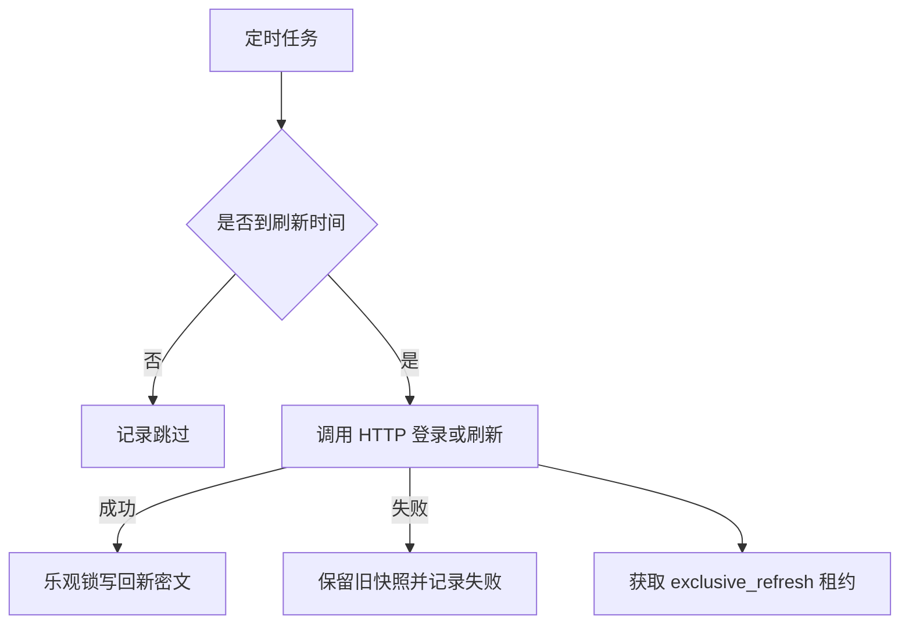

# 统一凭证刷新流程

定时任务只刷新开启自动刷新且已到间隔或临近过期的 HTTP 凭证；静态手工凭证和浏览器人工登录明确跳过。手工录入的 Cookie、Header 或 Token 可以选择 `http_refresh`，刷新器会把当前凭证注入请求，不需要账号密码。刷新前获取凭证级独占租约，释放租约后才提交事务。

| 步骤 | 说明 |
|---|---|
| 判断 | 根据 autoRefreshEnabled、刷新间隔、上次成功时间和过期时间窗口判断 |
| 租约 | 锁定凭证聚合根行后获取短期独占刷新租约，避免并发刷新 |
| 刷新 | 用认证配置和密文中的占位符组装请求；自动携带当前 Cookie/Header |
| 提取 | 支持 JSON 字段、响应头、单个响应 Cookie 和全部 `Set-Cookie`，Cookie 结果合并旧快照 |
| 写回 | revision 一致才写入；冲突不覆盖 |

参见：[统一凭证数据模型](../entities/data-models/credential-management.md)、[凭证接口契约](../contracts/credential-api.md)。

被引用：统一凭证数据模型、凭证接口契约。

## Web 用例浏览器状态

Web 用例的执行、录制和回放通过 `credentialBindingId` 读取 `playwright_storage` 投影。运行不会自动写回旧 Browser Session 或 Runtime Profile；录制完成后，用户可以显式将 Agent 上报的最终 storageState 创建为新的统一凭证和 Web 用例绑定。

只有 `writeback_enabled=true` 的 Web 绑定、客户端本地缓存已启用且 `expectedRevision` 一致时，才允许调用回写接口。
