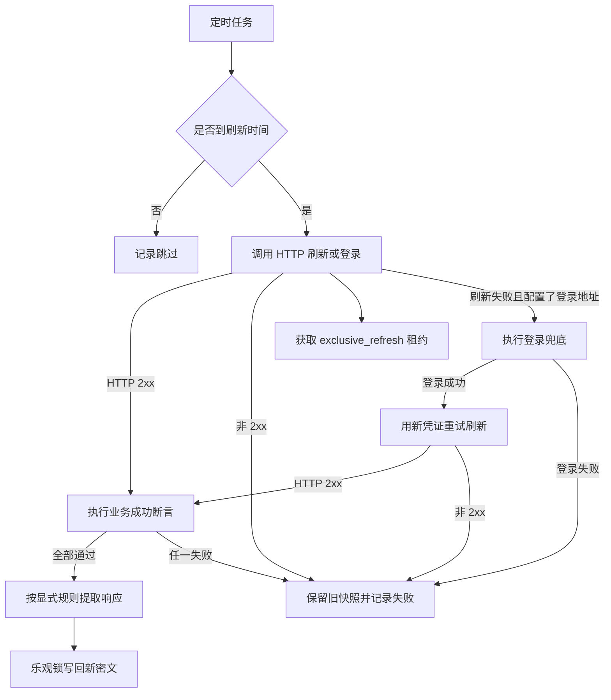

# 统一凭证刷新流程

定时任务只刷新开启自动刷新且已到间隔或临近过期的 HTTP 凭证；静态手工凭证和浏览器人工登录明确跳过。手工录入的 Cookie、Header 或 Token 可以选择 `http_refresh`，刷新器会把当前凭证注入请求，不需要账号密码。刷新前获取凭证级独占租约，释放租约后才提交事务。对于 `http_refresh` 且同时配置了 `login_url` 或 `login_steps` 的凭证，服务端会先按刷新接口续期；如果刷新失败，则自动执行登录，再用登录得到的新凭证重试刷新。前端编辑页会在 `http_refresh` 模式下额外提供“兜底登录接口”配置入口，方便直接维护刷新和登录两段请求。登录和刷新两次请求都会继续携带当前凭证中的附加 Header、附加 Cookie 和模板变量。

`http_login` 凭证配置了 `login_steps`（多步登录链）时，登录改由 `credential_login_chain_service` 执行：整条链共用一个 `httpx.Client`（步骤间 Set-Cookie 自动进入 Cookie Jar 延续），每步独立断言，`persistOutputs=false` 的输出是临时步骤变量（如一次性 ticket，通过 `${step.N.变量}` 或 `${step.<id>.变量}` 引用，链结束即丢弃），`persistOutputs=true` 的输出按响应映射规则写回凭证（普通字段输出同时注册为步骤变量）；任意一步失败即终止整链且不写回。`http_refresh` 凭证配置 `refresh_steps` 时刷新同样走链。步骤支持 `when` 条件（变量来自步骤输出或 secret 字段），条件不满足时跳过该步骤，兼容混合"需要/不需要 OTP"的账号；引用被跳过步骤的输出在渲染期明确报错。`login_steps`/`refresh_steps` 为空时回退单步模板，存量凭证行为不变。响应提取的公共能力（来源读取、`url_query`/`regex` 加工、断言、Cookie 写回、TOTP、请求日志脱敏）统一下沉在 `credential_http_util`，供单步刷新与多步链共用。前端编辑弹窗提供"多步认证链"开关、步骤编辑器（`CredentialStepsEditor.vue`）、流程预览与"测试登录/刷新流程"入口。

| 步骤 | 说明 |
|---|---|
| 判断 | 根据 autoRefreshEnabled、刷新间隔、上次成功时间和过期时间窗口判断；跳过原因细分写入任务摘要：未开启自动刷新为 `auto_refresh_off`（HTTP 登录/刷新模式每天最多补一条 `auto_refresh_off` 操作审计日志提醒）、未到期未到间隔为 `not_due`、配置无效为 `invalid_config`、租约冲突为 `lease_conflict` |
| 租约 | 锁定凭证聚合根行后获取短期独占刷新租约，避免并发刷新 |
| 刷新 | 用认证配置和密文中的占位符组装请求；自动携带当前 Cookie/Header；当 HTTP Header 凭证的 Header 名称为 `Cookie` 时，`${secret.cookie}` 读取其 Header 值；`${secret.headerValue}` 作为直接读取主 Header 值的高级变量；`http_refresh` 若同时配置登录地址，刷新失败会自动登录并重试刷新；前端会为 `http_refresh` 同时展示刷新接口和兜底登录接口配置区 |
| 业务成功 | HTTP 状态为 2xx 后，按登录或刷新各自的成功断言逐条校验；断言失败不会提取或写回，并保留旧快照 |
| 提取 | 仅按显式响应提取规则写回，支持 JSON 字段、响应头、单个响应 Cookie 和全部标准 `Set-Cookie`；不会自动合并 Cookie |
| 写回 | revision 一致才写入；冲突不覆盖 |

多步登录链逐步执行语义：

| 步骤 | 说明 |
|---|---|
| 变量渲染 | 每步请求前渲染 `${secret.字段}` 与 `${step.N.变量}`；TOTP 在每步执行前按 RFC 6238 重新生成，避免长链跨 30 秒窗口 |
| 请求 | 按 `bodyType` 发送 `none`/`form`/`json`/`multipart`；multipart 的 boundary 由 httpx 生成，用户手填的 `Content-Type` 被忽略 |
| 断言 | 先校验 HTTP 2xx，再按本步 `successAssertions` 逐条校验；失败抛出带步骤序号的异常并终止整链 |
| 临时输出 | `persistOutputs=false` 的输出写入执行上下文（同时注册序号与语义 id 两种引用键），提取不到立即终止（不允许后续步骤带空值请求）；这些值不会写入凭证密文 |
| 写回输出 | `persistOutputs=true` 的输出走响应映射写回（`header.cookie[.名称]`、`cookies[.名称]`、普通字段）；普通字段输出同时注册为步骤变量供后续步骤的模板与 when 条件引用；全部步骤完成后才由刷新主流程做乐观锁写回 |
| 条件 | 步骤可配置 `when`（变量支持 `step.N.变量`、`step.<id>.变量`、`secret.字段`），条件不满足时跳过该步骤及其输出；引用被跳过步骤的输出在渲染期报错，不会把占位符原样发出 |
| 兜底 | `http_refresh` 刷新失败且配置了 `login_steps` 或 `login_url` 时，兜底登录后用新凭证重试刷新（刷新同样支持多步链） |

参见：[统一凭证数据模型](../entities/data-models/credential-management.md)、[凭证接口契约](../contracts/credential-api.md)。

被引用：统一凭证数据模型、凭证接口契约。

## 编辑语义边界

编辑页通过 `/secret` 明文回填已保存敏感字段。默认登录请求模板（`username`/`password` 占位符）只在**新增**凭证时自动注入，编辑时不改写已保存模板；登录接口提供显式"恢复默认模板"按钮。更新凭证时显式传空串的主字段会从密文中删除（"清空即删除"），替代旧的"留空保留原值"语义；`headers`/`cookies` 对象仍由前端整体覆盖。

## Web 用例浏览器状态

Web 用例的执行、录制和回放通过 `credentialBindingId` 读取 `playwright_storage` 投影。运行不会自动写回旧 Browser Session 或 Runtime Profile；录制完成后，用户可以显式将 Agent 上报的最终 storageState 创建为新的统一凭证和 Web 用例绑定。

只有 `writeback_enabled=true` 的 Web 绑定、客户端本地缓存已启用且 `expectedRevision` 一致时，才允许调用回写接口。

## 模板变量与 Cookie 写回边界

请求模板继续只支持扁平变量 `${secret.字段名}`，不支持 `${secret.header.cookie}` 一类嵌套路径。前端在保存前验证变量名、闭合符号和当前凭证可用字段；`cookie` 是语义变量，主 Header 名称为 `Cookie` 时由 `headerValue` 兼容提供。`headerValue` 是直接读取存储字段的高级变量。

主 Header 名称为 `Cookie` 时，响应提取只能通过 `header.cookie` 或 `header.cookie.名称` 写回，刷新器会拒绝 `cookies` / `cookies.名称`，避免主 Header Cookie 和结构化 Cookie 同时持久化造成后续编辑冲突。主 Header 为 `Authorization`、`X-API-Key` 等非 Cookie 时，结构化 Cookie 写回保持允许，用于 Header + Cookie 联合认证。
