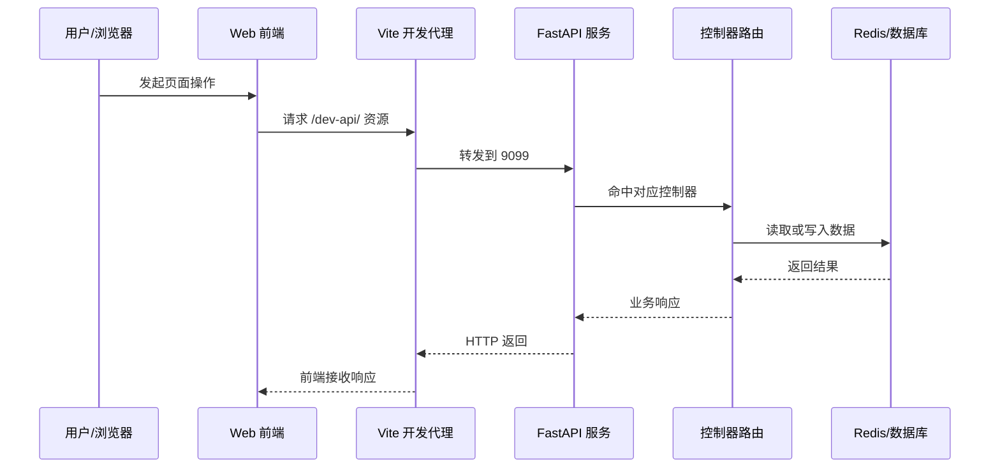

# HTTP API 入口流程

该流程覆盖前端开发代理到后端 FastAPI 路由的典型请求链路，以及后端应用启动时的路由聚合过程。

## 入口信息

| 类型 | 方法 | 路径 | 触发条件 |
|---|---|---|---|
| http | ANY | `/dev-api/*` | `web/vite.config.js` 开发代理转发 |
| http | ANY | FastAPI 注册路由 | `server/server.py` 完成应用启动后接收请求 |

## 详细步骤

| 步骤 | 说明 |
|---|---|
| 1 | 前端 `main.js` 启动并设置 `window.BASE_API`。 |
| 2 | Vite 在开发态把 `/dev-api` 请求代理到 `http://localhost:9099`。 |
| 3 | FastAPI 在 `server/server.py` 创建应用并注册所有控制器。 |
| 4 | 生命周期初始化完成数据库、Redis、权限和任务组件。 |
| 5 | 请求命中对应 `APIRouter`，进入模块服务逻辑。 |
| 6 | 响应返回给前端并更新页面状态。 |

## 错误处理

| 场景 | 处理方式 |
|---|---|
| 代理地址不可达 | 浏览器直接报网络错误，需检查 Vite 代理和后端端口。 |
| 路由未注册 | FastAPI 返回 404，需检查 `server/server.py` 的控制器列表。 |
| 配置缺失 | 应用启动阶段失败，需检查 `.env.*` 与 `server/config/env.py`。 |

## 参见

- [后端应用服务](../entities/services/backend-application.md)
- [前端启动骨架](../entities/components/frontend-bootstrap.md)

## 被引用

- [项目总览](../overview.md)
- [架构总览](../concepts/architecture-overview.md)
- [后端应用服务](../entities/services/backend-application.md)
- [前端启动骨架](../entities/components/frontend-bootstrap.md)
