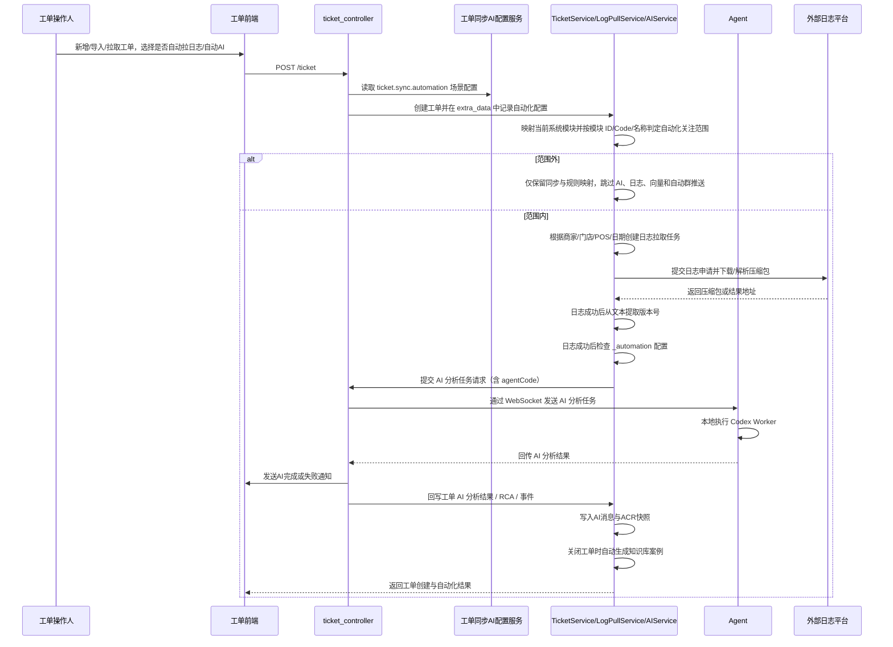

# 工单自动化链路流程

该流程描述工单创建、导入、手工新增后的自动拉日志与日志后自动 AI 分析链路，以及手工日志拉取、手工 AI 分析共用的任务编排方式。当前链路支持从工单信息直接提取商家、门店、POS 和日期拉取日志，并在日志中自动提取版本号后继续分析。

## 入口信息

| 类型 | 方法 | 路径 | 触发条件 |
|---|---|---|---|
| http | POST | `/ticket` | 创建工单时可同时填写日志拉取与自动 AI 配置 |
| http | POST | `/ticket/{ticket_id}/log-pulls` | 工单详情页手工提交日志拉取，或工单创建后自动触发 |
| http | POST | `/ticket/{ticket_id}/ai-analysis` | 手工发起 AI 分析，或日志拉取成功后自动触发 |

## 详细步骤

| 步骤 | 说明 |
|---|---|
| 1 | 新增、导入或远端拉取工单时，前端可勾选是否需要拉取日志，并在同一表单里填写日志拉取参数。 |
| 2 | 日志拉取参数支持商家、门店、POS 和日期组合；页面会先从系统配置拉取可选商家/门店，再按选择联动约束门店候选。 |
| 3 | 若勾选“日志后自动 AI”，前端同时要求选择 Agent；后端会把 Agent 编码与通知配置一并写入日志拉取记录的内部自动化配置。 |
| 4 | `TicketService.create_ticket` 在保存工单后可同步创建日志拉取任务，并把自动化配置写入工单 `extra_data.ticket_automation` 便于追溯；日志拉取服务会先查外部列表，已可下载时直接进入下载流程，否则再提交申请并轮询。 |
| 5 | `TicketLogPullService._process_record` 在日志拉取成功后读取记录中的 `_automation` 配置；该字段仅用于内部自动化联动，不参与外部平台轮询匹配。 |
| 6 | 日志拉取成功后，服务端会先尝试从日志正文中直接提取版本号；若未找到版本号则发送通知并跳过后续 AI 分析。 |
| 7 | 若自动化配置开启 AI 且存在 Agent 编码，服务端构造 `TicketAiAnalysisRequestModel` 并触发分析任务。 |
| 8 | `TicketAiAnalysisService.create_analysis_task_services` 将请求里的 `agentCode` 写入任务上下文，后续由服务端编排到对应 agent；任务成功或失败结束时都会按通知配置发送消息。 |
| 9 | agent 端收到任务后执行本地 Codex Worker，结果再经 WebSocket 回传服务端入库；Worker 由后台线程执行，避免阻塞 WebSocket 事件循环。整包日志按工单、日志记录和来源指纹缓存到 Agent 本地 `log_cache`，相同成功日志再次分析直接复用已下载解压目录；手动分析可选择该工单的成功日志，未选择时使用最新成功记录。任务级 Codex Home 会复制基础配置及 `config.toml` 中相对 `model_catalog_json` 引用的模型目录，避免隔离配置缺文件导致 Worker 启动即失败。Worker 失败时会回传脱敏的 Provider、模型、实际基础地址、认证来源和 API Key 指纹；仅当 Codex 输出命中 401/Unauthorized/Invalid token 时，才以同一认证信息异步调用 `GET /models`，不调用模型推理，用于区分 token 无效与 Responses 链路异常。服务端在同一 Agent 有未完成请求时会跳过离线判定，并在完整响应分片到达后回写 Future；如果重试同一任务 ID，agent 会先检查工作区历史结果，存在可用结果则直接返回，任务仍在运行则提示稍后重试。AI 结果 schema 只强制核心分析字段，协同增强字段缺省时由服务端补默认值。 |
| 10 | 手工发起日志拉取、手工补录工单和工单详情页中的重新拉取入口仍保留；这些入口复用同一套日志拉取与 AI 分析服务，避免前后端出现两套流程。 |
| 11 | 工单详情页的日志拉取、工单新增页的日志拉取、独立日志拉取管理页是三个前端页面，但共用同一套后端日志拉取模型、选项接口和重试逻辑。 |
| 12 | 工单详情页中商家和门店已切换为联动下拉，不再要求手工输入纯文本或数字。 |
| 13 | 日志拉取记录的重新拉取会从历史 `command_content` 反向恢复提交参数，补齐通知配置与自动化字段，降低“缺少对应参数”问题。 |
| 14 | AI 结果通知在分析成功和失败两种情况下都会发送，方便业务侧闭环确认。 |
| 15 | AI 结果 schema 只强制核心分析字段，协同增强字段缺省时由服务端补默认值。 |
| 16 | 翻译、标题总结、分类、参数提取和知识提炼统一由 `TicketSyncAiConfigService` 从 `ticket.sync.automation` 读取开关、Provider 和提示词；旧 `ticket.ai.*` 配置不再参与运行。同步前会先由 `TicketAutomationScopeService` 对已映射系统模块判定关注范围，范围外只保留基础同步和规则映射，跳过所有自动 AI、日志、向量和自动群推送。 |
| 17 | 多维表格主动拉取任务显式提供 `automation` 时使用任务级配置；未提供时按 `ticket.sync.automation` 的 `bitable_pull` 场景开关执行。 |
| 8 | 工单详情页中的时间线、评论、日志拉取和 AI 分析改为按需加载，评论作为详情一级 tab 独立请求，避免打开详情或历史页时一次性拉取所有数据。 |
| 9 | 协同追问会先写入 `ticket_message`，再复用 AI 分析任务入口读取消息流、快照和相似历史工单做增量分析；相似工单由 `ticket.similarity.config` 选择 `local_hash`、`embedding` 或 `qdrant` Provider，严格按配置查询，失败直接报错或记录日志，不再回退其他 Provider；下发给 Agent 的日志正文会按首尾保留策略截断，避免超大上下文导致上游模型接口失败。 |
| 10 | AI 分析成功后写回 `ticket.ai_analysis`、RCA、AI 消息和 `ticket_snapshot`；工单关闭时自动提炼 `knowledge_article` 供后续相似工单检索。 |
| 11 | 历史工单可通过 `POST /ticket/similarity/rebuild` 批量重建向量，重建文本包含标题、描述、AI 摘要和 RCA；手动指定范围使用 `ticketNos` 传业务工单号，服务端解析为系统 `ticket_id` 后复用重建流程。当前是一条工单一次外部 Embedding 请求，不合并多工单请求。`provider=local_hash` 只写数据库 `embedding_record` 的本地 hash，`provider=embedding` 只写数据库 `embedding_record` 的外部向量，`provider=qdrant` 只同步 Qdrant。同步 Qdrant 前会校验本次实际向量维度与 collection 维度，失败日志会带 Qdrant 响应体；开启 `recreateCollectionOnDimensionMismatch` 时，写入链路会删除旧 collection 并重建。外部异常会熔断后续批量请求。默认 `forceRebuild=false`，同一模型、版本、维度、字段列表和最终文本未变化时会复用本地向量；只有手动开启强制重建才重新请求外部接口。 |
| 12 | 相似工单配置页面可保存 `sceneTriggers`；外部同步、远端拉取、手动新增、手动编辑、Excel 导入和关闭知识沉淀链路会按开关决定是否自动调用向量化。 |
| 13 | 工单详情页相似推荐优先读取当前工单已保存向量并查询库内向量或 Qdrant；当前工单向量缺失或过期时，会按当前 Provider 配置同步刷新向量后再查询相似工单。 |

## 错误处理

| 场景 | 处理方式 |
|---|---|
| 自动拉日志但缺少日志参数 | 创建工单前直接校验并返回失败，阻止生成不完整任务。 |
| 自动 AI 但未选择 Agent | 前端与后端都拒绝提交，避免任务落到默认 Agent。 |
| 日志拉取成功后自动 AI 提交失败 | 保留日志拉取成功结果，并在系统日志记录自动 AI 失败原因，同时按通知配置发送失败消息。 |
| 日志正文未提取到版本号 | 发送通知并停止后续 AI 分析，避免把无版本号任务误投递到仓库映射。 |
| Agent 不在线 | AI 分析任务失败，服务端返回明确的 agent 不在线提示。 |
| 指定 Agent 未连接 | 提交 AI 分析前直接校验在线连接，未连接时接口返回明确原因；若提交后连接异常导致后台快速失败，前端短轮询任务终态并弹出 `errorMessage`。 |
| AI 分析成功或失败 | 分别发送成功/失败通知，通知渠道由页面保存的推送配置决定。 |
| Codex/OpenAI 返回 `bad_response_status_code` | Agent 返回更明确的上游异常摘要；服务端通过日志截断和放宽增强字段必填约束降低重试失败概率。 |
| Codex 启动返回 `os error 2` | Agent 在启动 Worker 前校验并复制任务级 Codex Home 引用的模型目录文件；引用缺失时返回包含 `model_catalog_json` 路径的明确错误。 |
| Codex 返回 401/Unauthorized/Invalid token | Agent 记录脱敏认证指纹并执行一次无推理的 `/models` 鉴权探测；若探测 401 则优先检查 Provider key，若探测 200 则携带 Worker 与探测 request ID 排查 Provider Responses 链路。 |

## 参见

- [工单域](../entities/services/ticket-domain.md)
- [工单核心数据模型](../entities/data-models/ticket-core-models.md)
- [工单流转路由流程](ticket-workflow-routing.md)

## 被引用

- [内容目录](../index.md)
- [工单域](../entities/services/ticket-domain.md)
- [工单核心数据模型](../entities/data-models/ticket-core-models.md)
