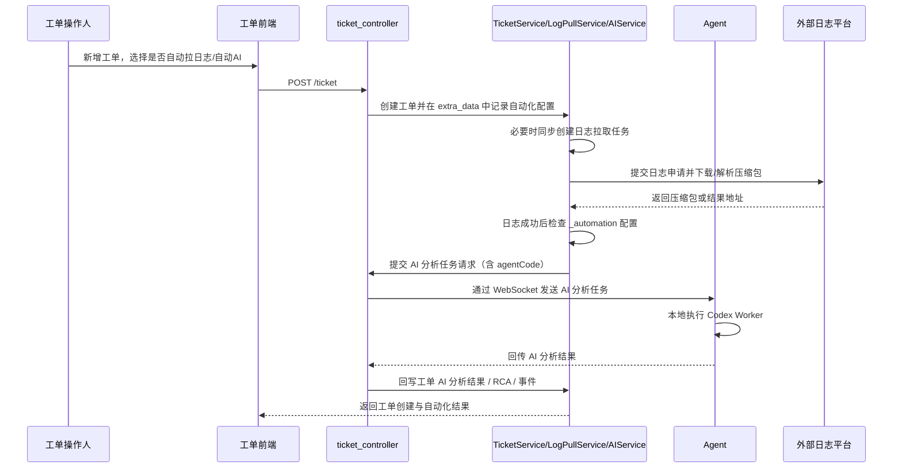

# 工单自动化链路流程

该流程描述工单创建时可选的自动拉日志与日志后自动 AI 分析链路，以及手工日志拉取、手工 AI 分析共用的任务编排方式。

## 入口信息

| 类型 | 方法 | 路径 | 触发条件 |
|---|---|---|---|
| http | POST | `/ticket` | 创建工单时可同时填写日志拉取与自动 AI 配置 |
| http | POST | `/ticket/{ticket_id}/log-pulls` | 工单详情页手工提交日志拉取，或工单创建后自动触发 |
| http | POST | `/ticket/{ticket_id}/ai-analysis` | 手工发起 AI 分析，或日志拉取成功后自动触发 |

## 详细步骤

| 步骤 | 说明 |
|---|---|
| 1 | 新增工单时，前端可勾选是否需要拉取日志，并在同一表单里填写日志拉取参数。 |
| 2 | 若勾选“日志后自动 AI”，前端同时要求选择 Agent，后端将 Agent 编码写入日志拉取记录的内部自动化配置。 |
| 3 | `TicketService.create_ticket` 在保存工单后可同步创建日志拉取任务，并把自动化配置写入工单 `extra_data.ticket_automation` 便于追溯。 |
| 4 | `TicketLogPullService._process_record` 在日志拉取成功后读取记录中的 `_automation` 配置；该字段仅用于内部自动化联动，不参与外部平台轮询匹配。 |
| 5 | 若自动化配置开启 AI 且存在 Agent 编码，服务端构造 `TicketAiAnalysisRequestModel` 并触发分析任务。 |
| 6 | `TicketAiAnalysisService.create_analysis_task_services` 将请求里的 `agentCode` 写入任务上下文，后续由服务端编排到对应 agent。 |
| 7 | agent 端收到任务后执行本地 Codex Worker，结果再经 WebSocket 回传服务端入库。 |
| 8 | 工单详情页中的时间线、日志拉取和 AI 分析改为按需加载，避免打开详情时一次性拉取大量数据。 |

## 错误处理

| 场景 | 处理方式 |
|---|---|
| 自动拉日志但缺少日志参数 | 创建工单前直接校验并返回失败，阻止生成不完整任务。 |
| 自动 AI 但未选择 Agent | 前端与后端都拒绝提交，避免任务落到默认 Agent。 |
| 日志拉取成功后自动 AI 提交失败 | 保留日志拉取成功结果，并在系统日志记录自动 AI 失败原因。 |
| Agent 不在线 | AI 分析任务失败，服务端返回明确的 agent 不在线提示。 |

## 参见

- [工单域](../entities/services/ticket-domain.md)
- [工单核心数据模型](../entities/data-models/ticket-core-models.md)
- [工单流转路由流程](ticket-workflow-routing.md)

## 被引用

- [内容目录](../index.md)
- [工单域](../entities/services/ticket-domain.md)
- [工单核心数据模型](../entities/data-models/ticket-core-models.md)
