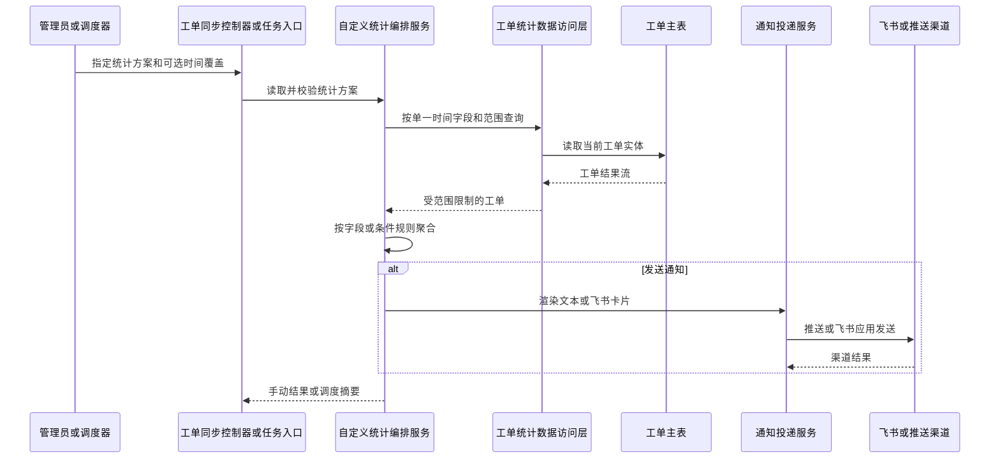

# 工单自定义统计通知流程

该流程基于当前系统工单数据进行实时统计。手动执行可以选择仅预览，定时任务始终按方案通知配置投递消息。

## 入口信息

| 类型 | 方法 | 路径 | 触发条件 |
|---|---|---|---|
| HTTP | `POST` | `/ticket/sync/custom-statistics/run` | 管理员手动执行一个、多个或全部启用方案。 |
| HTTP | `GET` | `/ticket/sync/custom-statistics/definitions` | 前端获取字段、时间字段和操作符白名单。 |
| 定时任务 | `task` | `module_task.scheduler_maintenance.ticket_custom_statistics_report` | Celery 周期任务执行。 |

## 详细步骤

| 步骤 | 说明 |
|---|---|
| 1 | 读取 `customStatisticsProfiles`，只选择启用且编码匹配的方案。 |
| 2 | 解析相对时间范围或成对的手动开始/结束时间，统一为上海时间。 |
| 3 | DAO 将范围筛选和指定的单一时间列下推到数据库，时间区间为左闭右开。 |
| 4 | 服务以 ORM 工单实体构造白名单字段源，按字段原值或安全条件规则聚合。 |
| 5 | 扫描超过 50,000 条时中止，提示收窄范围。 |
| 6 | 手动 `send=false` 仅返回内存结果；否则按方案的推送、飞书或混合渠道发送。 |
| 7 | 定时任务仅返回方案编码、总数和渠道发送摘要，不包含分组明细。 |

## 错误处理

| 场景 | 处理方式 |
|---|---|
| 方案编码不存在或没有启用方案 | 拒绝执行并返回明确错误。 |
| 仅传开始或结束时间、或结束不晚于开始 | 拒绝执行，要求提供有效时间区间。 |
| 固定时间范围不合法 | 拒绝该方案，避免隐式改成今天。 |
| 扫描超过上限 | 中止统计且不发送半成品结果。 |
| 没有可用通知渠道 | 返回 `skipped + skipReason`，统计结果仍可在手动执行响应中查看。 |
| 飞书或推送单个目标失败 | 记录目标与异常，继续发送其他目标并返回成功数量。 |

## 参见

- [工单自定义实时统计服务](../entities/services/ticket-custom-statistics.md)
- [工单自定义统计接口与配置契约](../contracts/ticket-custom-statistics.md)
- [任务调度域](../entities/services/task-scheduler-domain.md)

## 被引用

- [内容目录](../index.md)
- [工单域](../entities/services/ticket-domain.md)
- [工单自定义实时统计服务](../entities/services/ticket-custom-statistics.md)
- [工单自定义统计接口与配置契约](../contracts/ticket-custom-statistics.md)
- [任务调度域](../entities/services/task-scheduler-domain.md)
