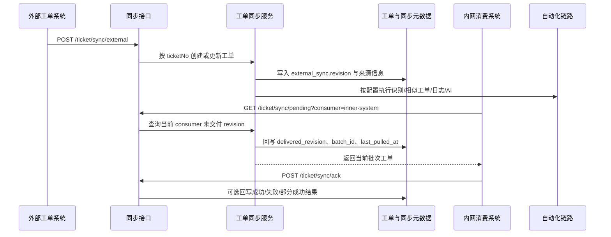

# 工单外部同步与内网拉取流程

该流程描述双环境部署下的工单同步链路：公网环境可作为外部工单入口，内网环境按消费方拉取未交付版本；是否已经被拉取不再依赖单一布尔值，而是按工单版本和消费方分别跟踪。

## 入口信息

| 类型 | 方法 | 路径 | 触发条件 |
|---|---|---|---|
| http | POST | `/ticket/sync/external` | 外部系统推送工单，或内部系统把拉到的工单重新入站 |
| http | GET | `/ticket/sync/pending` | 内网消费方按 `consumer` 拉取当前未交付版本 |
| http | POST | `/ticket/sync/ack` | 内网消费方需要可选回写本批次处理结果 |

## 详细步骤

| 步骤 | 说明 |
|---|---|
| 1 | 外部系统调用 `POST /ticket/sync/external`，必填 `ticketNo`、`description`、`internalPriority`、`ticketVender`、`ticketModle`、`createTime`、`reporterName`；`title` 允许缺省。 |
| 2 | `TicketSyncService.sync_external_ticket` 以 `ticketNo` 为幂等键创建或更新工单，并在 `extra_data.external_sync` 中递增 `revision`。 |
| 3 | 同步元数据会记录来源系统、来源记录 ID、远端 source revision、外部原始创建时间（`externalCreateTime`）、最近导入时间、最近一次交付状态、每个消费方的交付 revision 以及自动化执行状态。 |
| 4 | 主链路会先完成工单入库并快速返回；入库后先写 `publish_ready=false`、`publish_status=processing_ai`，AI翻译、AI标题总结、自动化与群推送改为后台异步后处理，避免阻塞 `POST /ticket/sync/external` 请求。 |
| 5 | 字段识别采用可配置映射和正则规则：项目/模块/商家按关键词包含匹配；处理人按完整名称匹配（支持 email）；门店按商家ID+`sap_org_no` 查询配置。规则统一存放在 `ticket.sync.automation`。 |
| 6 | 内网消费方调用 `GET /ticket/sync/pending` 时，只会拿到 `external_sync.revision > consumers.{consumer}.delivered_revision` 且 `publish_ready=true` 的工单。 |
| 7 | 拉取成功后，服务端立即回写该消费方的 `delivered_revision`、`last_batch_id` 和 `last_pulled_at`，防止同一 revision 被重复返回。 |
| 8 | 如果消费方还需要把“已处理”“处理失败”“部分成功”等结果反馈回公网环境，可调用可选接口 `POST /ticket/sync/ack`。 |
| 9 | 同一工单后续只要再次从外部系统同步进入，`revision` 会继续递增，内网消费方下次仍可拉到新的版本。 |
| 10 | 自动群推送采用“仅一次成功发送”标记：`group_push_sent_once=true` 后，即使后续是同工单更新也不会重复自动发群消息；手动发群不受此标记限制。 |

## 错误处理

| 场景 | 处理方式 |
|---|---|
| 外部同步缺少必填字段（`ticketNo`、`description`、`internalPriority`、`ticketVender`、`ticketModle`、`createTime`、`reporterName`） | 直接参数校验失败并记录日志，拒绝入站 |
| 自动识别无法确定项目/模块归属 | 保留原始工单与同步元数据，识别步骤状态照常落库，不阻断同步主流程 |
| 自动拉日志或自动 AI 异常 | 在 `extra_data.external_sync.sync_state.automation` 中记录失败步骤和错误信息；AI 任务终态（成功/失败/取消）都会将 `publish_ready` 置为 `true`，不阻断入库数据最终发布 |
| 消费方拉取后自身处理失败 | 当前 revision 已标记为 delivered；如需补充处理结果，可再调用 `POST /ticket/sync/ack` 记录失败原因 |

## 参见

- [工单域](../entities/services/ticket-domain.md)
- [工单自动化链路流程](ticket-automation-flow.md)
- [HTTP API 入口流程](http-api-entrypoint.md)

## 被引用

- [内容目录](../index.md)
- [工单域](../entities/services/ticket-domain.md)
