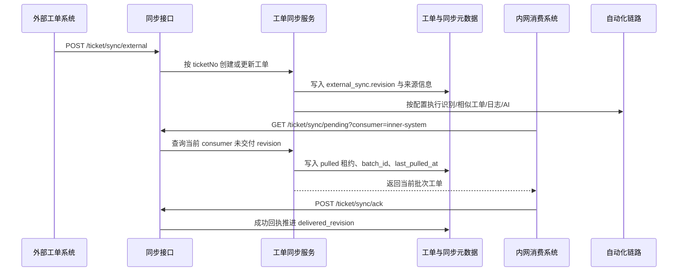

# 工单外部同步与内网拉取流程

该流程描述双环境部署下的工单同步链路：公网环境可作为外部工单入口，内网环境按消费方拉取未交付版本；是否已经被拉取不再依赖单一布尔值，而是按工单版本和消费方分别跟踪。

## 入口信息

| 类型 | 方法 | 路径 | 触发条件 |
|---|---|---|---|
| http | POST | `/ticket/sync/external` | 外部系统推送工单，或内部系统把拉到的工单重新入站 |
| http | GET | `/ticket/sync/pending` | 内网消费方按 `consumer` 拉取当前未交付版本 |
| http | POST | `/ticket/sync/ack` | 内网消费方需要可选回写本批次处理结果 |

## 详细步骤

| 步骤 | 说明 |
|---|---|
| 1 | 外部系统调用 `POST /ticket/sync/external`，必填 `ticketNo`、`description`、`internalPriority`、`ticketVender`、`ticketModle`、`createTime`、`reporterName`；`title` 允许缺省。 |
| 2 | `TicketSyncService.sync_external_ticket` 以 `ticketNo` 为幂等键创建或更新工单，并在 `extra_data.external_sync` 中递增 `revision`。 |
| 3 | 同步元数据会记录来源系统、来源记录 ID、远端 source revision、外部原始创建时间（`externalCreateTime`）、最近导入时间、最近一次交付状态、每个消费方的交付 revision 以及自动化执行状态。 |
| 4 | 主链路会先完成工单入库并快速返回；入库后先写 `publish_ready=false`、`publish_status=processing_ai`，AI翻译、AI标题总结、自动化与群推送改为后台异步后处理，避免阻塞 `POST /ticket/sync/external` 请求。 |
| 5 | 字段识别采用可配置映射和正则规则：项目/模块/商家按关键词包含匹配；处理人按完整名称匹配（支持 email）；门店按商家ID+`sap_org_no` 查询配置。项目或模块未匹配本地 HRM 配置时，会保留外部原始文本到工单项目/模块名称字段。已有工单再次同步时，只要本次外部数据携带项目或模块字段，就按本次解析结果覆盖旧归属；解析不到本地 ID 时清空旧 ID 并保留本次外部文本。规则统一存放在 `ticket.sync.automation`。 |
| 5.1 | 外部推送多维表格邮箱补齐由 `externalSyncBitable.enabled` 控制；同一工单已成功补齐过同一个 `recordId` 时，会根据 `extra_data.external_sync.bitableEmailSync` 跳过重复查询。 |
| 5.1.1 | 飞书多维表格相关配置已收敛到公共配置 `bitableCommon`；外部推送邮箱补齐、按人催办、汇总统计和主动拉取默认继承公共配置，局部配置非空时覆盖。 |
| 5.1.2 | 新增主动拉取链路 `bitablePull`：调度任务按条件查询飞书多维表格记录，由 `TicketBitablePullService` 经 `fieldMappings` 映射成外部同步字段后复用 `POST /ticket/sync/external` 入库；任务参数提供映射时优先于可视化配置；默认时间窗口在飞书 `records/search` filter 中按更新时间字段或创建时间字段大于等于当前时间前 1 小时执行，`createdAfter` 仅用于覆盖窗口下限；嵌套 filter 会在最外层 `children` 追加默认时间窗口并递归补齐内部时间字段空值，扁平 filter 只补齐已有时间字段；分页查询中 `page_size/page_token` 放在 URL 查询参数，`filter/view_id/view_type` 放在请求体，并对重复 `page_token` 熔断，避免飞书返回同一页导致循环拉取。 |
| 5.1.3 | 主动拉取会把 `recordId + snapshotHash` 记录到 `extra_data.bitable_pull`；同一记录内容未变化时跳过，避免周期任务反复制造新 revision。 |
| 5.1.4 | 飞书“查询记录”接口在当前环境中可能只返回 `record_id`；服务会继续按缺失记录的 `record_id` 调用 `records/batch_get(with_shared_url=true)` 批量补齐 `shared_url`，主动拉取和按人催办统一透传该真实详情地址，不再直接拼接页面 URL。 |
| 5.1.5 | 主动拉取配置页的字段预览优先读取飞书字段元数据，不使用运行时 `filterFormula/createdAfter`；字段元数据不可用时才回退到不带过滤条件的样例记录推断字段，避免最近时间窗口无记录导致字段下拉为空。 |
| 5.1.6 | 主动拉取定时任务没有登录用户时，会使用完整系统用户上下文投递延后后处理 Celery：`permissions=[]`、`roles=[]`、`user.userId=0`、`user.userName=system`；延后后处理入口也兼容历史只包含 `user` 的任务载荷。 |
| 5.1.7 | 主动拉取字段映射目标字段会将 `moduleName/module_name/ticketModel/ticket_model` 归一为 `ticketModle`，避免模块别名配置被外部同步必填校验误判为缺失。 |
| 5.1.8 | 主动拉取支持 `forceSync/force_sync`，开启后绕过本地 `recordId + snapshotHash` 跳过逻辑，重新执行入库与延后后处理；该参数不改变飞书查询范围，历史记录仍需通过 `createdAfter/filterFormula/viewId` 查到。 |
| 5.1.9 | 主动拉取映射出的 `ticketVender/ticketModle/internalOwner` 会保存到 `extraData.external_field_mapping`，并同步为 `projectName/moduleName/internalOwnerName` 给入库识别使用；主动拉取 `automation.autoTranslate` 优先于全局 `autoTranslateOnSync`。 |
| 5.1.10 | 主动拉取转换模型时会执行专用字段兜底：`internalPriority` 为空且 `customerPriority` 有值时使用对方优先级补齐内部优先级；`ticketAssigneeName/assigneeName` 等别名会归一为当前处理人，并写入顶层模型和 `extraData.external_field_mapping`。该逻辑只作用于主动拉取，不改变外部推送入口。 |
| 5.1.11 | 主动拉取记录级必填校验直接使用“外部工单字段模型”中 `required=true` 的字段；字段不全时 `_build_bitable_pull_sync_object` 返回空，任务汇总计入 `failedCount`，不会进入 `sync_external_ticket`，因此不会入库或自动发群消息。 |
| 5.1.12 | 主动拉取识别飞书长文本富文本片段数组，按片段顺序拼接并保留 `"\n"` 为真实换行；空文本片段自然忽略，不再把换行或空片段 JSON 化为普通文本，保证描述格式和 `stepReason` 评论日期行分割不丢失。 |
| 6 | 内网消费方调用 `GET /ticket/sync/pending` 时，优先拿到 `external_sync.revision > consumers.{consumer}.delivered_revision` 且 `publish_ready=true` 的工单；若候选工单卡在 `processing_ai` 但没有活动 AI 任务，会先自动恢复发布状态再返回。 |
| 7 | 内网将远端 pending 工单转换为本地入库模型时，会优先读取 `moduleName/module_name`，并兼容 `ticketModle/ticketModel/ticket_model` 与 `extraData.external_field_mapping.ticketModle`，避免模块文本在跨环境二次同步时丢失。 |
| 7.1 | 远端拉取入库不会复用公网项目/模块/用户 ID，但已有本地工单会同步远端最新项目/模块文本并清空旧本地 ID；状态会使用内网本地 `statusMappings` 映射远端状态文本，并通过 `assigneeMappings`、邮箱或姓名解析当前处理人、报告人和内部负责人；未命中时保留远端文本。 |
| 7.1.1 | 远端拉取链路由 `remoteSync.enabled` 控制，不会再次查询公网飞书多维表格；公网补齐后的邮箱会随 pending payload 带到内网，内网只做本地人员解析。 |
| 7.2 | 外部 `stepReason` 会按 `20260616 人员：` 或 `20260616：` 拆分为同步评论；pending payload 携带同步评论，内网按 `sourceSegmentKey` 幂等写入，保留本地评论不被覆盖。 |
| 8 | pending 返回后，服务端先写入该消费方的 `status=pulled`、`last_revision`、`last_batch_id` 和 `last_pulled_at` 作为 30 分钟租约；成功 ack 后才推进 `delivered_revision`。 |
| 9 | 如果消费方还需要把“已处理”“处理失败”“部分成功”等结果反馈回公网环境，可调用可选接口 `POST /ticket/sync/ack`；只有成功状态会推进 `delivered_revision`，失败状态只记录错误，保留同一 revision 下次重试。 |
| 10 | 同一工单后续只要再次从外部系统同步进入，`revision` 会继续递增，内网消费方下次仍可拉到新的版本；项目、模块、商家日志拉取提示等外部字段变化会随本次入库同步更新，不再沿用旧工单归属。 |
| 11 | 自动群推送采用“仅一次成功发送”标记：`group_push_sent_once=true` 后，即使后续是同工单更新也不会重复自动发群消息；手动发群不受此标记限制。 |
| 12 | 飞书话题评论同步由 `ticket.sync.automation.messageSync` 控制，默认关闭；公网 webhook 由 `feishuEventEnabled` 控制并继续通过 `POST /ticket/webhook/feishu/message` 接收飞书消息事件；无公网长连接由 `feishuWsEnabled` 控制，服务启动时通过 `lark_oapi` 的 `lark.ws.Client` 监听 `im.message.receive_v1`。两种入站方式都按 `message_id` 生成评论幂等键写入 `ticket_comment`，并可按配置追加写回多维表格排查过程字段；入站发送人会优先用 `sender.open_id` 查询飞书用户详情并写入用户名，避免把 `open_id/union_id` 直接展示给用户；正文中的 `@_user_1` 会按 `mentions` 替换为 `@用户名`，并在 `attachments.content_segments` 保留人员 ID，供写回多维表格或飞书群时恢复真实 @。 |
| 13 | 群推送应用发送成功后会把飞书 `messageId/rootId/threadId/chatId` 写入 `ticket.extra_data.external_sync.sync_state.group_push_message_refs`，后续飞书事件优先按这些锚点匹配工单；历史无锚点消息会回退从文本识别工单号。 |
| 14 | 为避免“飞书评论写回多维表格后又被主动拉取”造成重复评论，评论同步会同时使用 `source_segment_key` 与 `source_content_hash` 去重；同一工单同一内容哈希已存在时跳过新增。 |
| 15 | 长连接监听使用后台守护线程运行，每条事件创建独立数据库会话；当前 SDK 只提供 `start()`，应用关闭时只能标记停止并等待进程退出释放连接。 |

## 错误处理

| 场景 | 处理方式 |
|---|---|
| 外部同步缺少必填字段（`ticketNo`、`description`、`internalPriority`、`ticketVender`、`ticketModle`、`createTime`、`reporterName`） | 直接参数校验失败并记录日志，拒绝入站 |
| 自动识别无法确定项目/模块归属 | 保留原始项目/模块文本与同步元数据，识别步骤状态照常落库，不阻断同步主流程 |
| 自动拉日志或自动 AI 异常 | 在 `extra_data.external_sync.sync_state.automation` 中记录失败步骤和错误信息；AI 任务终态（成功/失败/取消）都会将 `publish_ready` 置为 `true`，不阻断入库数据最终发布 |
| 消费方拉取后自身处理失败 | failed 回执不会推进 `delivered_revision`，仅记录失败状态、失败 revision 和错误信息；下一次 pending 拉取仍可返回同一 revision 重试 |
| 飞书事件重复投递 | 使用飞书 `message_id` 构造 `source_segment_key`，重复事件只会命中已存在评论并跳过 |
| 飞书写回多维后被主动拉取 | 同一工单相同 `source_content_hash` 的评论不再重复新增 |
| 历史工单未记录话题锚点 | 飞书入站会回退按文本工单号匹配；系统评论回发话题会跳过并返回 `missing_group_message_anchor` |

## 参见

- [工单域](../entities/services/ticket-domain.md)
- [工单自动化链路流程](ticket-automation-flow.md)
- [HTTP API 入口流程](http-api-entrypoint.md)

## 被引用

- [内容目录](../index.md)
- [工单域](../entities/services/ticket-domain.md)
