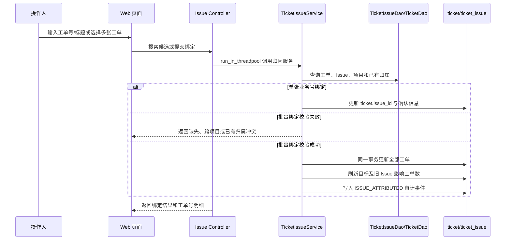

# 工单问题实例关联流程

问题实例是多张工单共同指向的真实问题主归因。工单类型、细分问题和相似度检索可以提供分类或候选，但只有人工确认后才写入 `ticket.issue_id`。

## 入口与接口

| 方法 | 路径 | 权限 | 用途 |
| --- | --- | --- | --- |
| GET | `/ticket/issues/ticket-options` | `ticket:issue:query` | 工单号/标题远程搜索，最多返回 20 条 |
| POST | `/ticket/issues/{issue_id}/tickets/bind` | `ticket:issue:bind` | 按 `ticketNo` 绑定单张工单 |
| POST | `/ticket/issues/bind-batch` | `ticket:issue:bind` | 按 `ticketNos` 批量绑定已有 Issue |
| POST | `/ticket/issues/export-tickets` | `ticket:issue:export` | 导出选中问题实例的关联工单 |
| POST | `/ticket/{ticket_id}/issue/bind` | `ticket:issue:bind` | 兼容已有的内部 ID 绑定入口 |

## 业务规则

- 数据库继续使用 `ticket_id` 和 `first_ticket_id` 作为稳定关联；用户界面使用 `ticketNo` 和 `firstTicketNo`。
- 问题管理页面只加载搜索候选，不加载全量可关联工单列表；已绑定工单使用详情表格展示。
- 工单详情支持直接关联或更换已有 Issue，解决相似工单没有合适代表工单的问题。
- 工单列表批量操作只针对当前页已选择工单，不实现跨分页全选。
- 批量请求先全量校验；工单不存在、目标 Issue 不存在、项目不一致或已有其他 Issue 归属时，默认整体拒绝，不产生部分更新。
- `allowReassign=true` 才允许覆盖其他 Issue；转移时同时刷新旧 Issue 和目标 Issue 的 `affected_ticket_count`。
- 相同目标 Issue 的重复绑定幂等成功；不为批量工单两两创建 `ticket_relation`。
- 相似度、问题类型和 AI 分类不会绕过人工确认自动写入主归因。
- 绑定、转移和解绑写入 `TicketEventType.ISSUE_ATTRIBUTED`，包括操作人、原归属、目标归属、关系类型和备注。

## 关联工单导出

- 问题实例管理页面必须先选中一个或多个问题实例，随后打开列选择对话框；问题编号和问题名为不可取消的必选列。
- 前端把 `issueId` 保持为字符串传给 Pydantic 请求模型，由接口边界解析为整数，避免 JavaScript `Number()` 损失 BIGINT 精度。
- 后端按选中问题实例聚合其关联工单；没有关联工单的问题实例仍保留一行，以便导出数据可追溯。

## 版本信息

Issue 不保存单一版本字段。问题详情中的版本信息由其绑定工单的四类版本中心 ID 反查展示：发生版本、计划修复版本、实际修复版本和实际发版版本。一个 Issue 跨多个版本时，先按绑定工单实时聚合，避免丢失多版本事实。

## 参见

- [工单域](../entities/services/ticket-domain.md)
- [工单核心数据模型](../entities/data-models/ticket-core-models.md)
- [工单项目版本中心](../concepts/ticket-version-center.md)
- [工单详情用户说明](../../web/public/docs/ticket_detail.md)

## 被引用

- [内容目录](../index.md)
- [工单域](../entities/services/ticket-domain.md)
- [工单核心数据模型](../entities/data-models/ticket-core-models.md)
