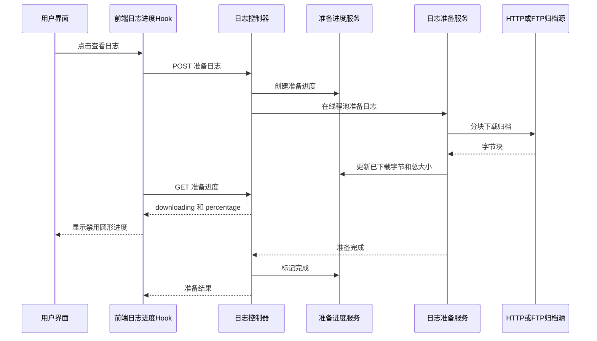

# 工单日志拉取记录独立查看流程

同一个工单存在多条日志拉取记录时，日志查看必须按“工单 + 拉取记录”定位。指定 `recordId` 查看时，后端使用 `data/logs/ticket_{ticketId}/record_{recordId}` 作为准备目录；未指定记录时继续兼容旧的 `data/logs/ticket_{ticketId}`。

## 关键规则

- `POST /ticket/logs/prepare` 接收 `ticketId + recordId`，并校验指定记录必须属于当前工单。
- `GET /ticket/logs/prepare-progress` 以 `ticketId + recordId` 从 Redis 查询实时准备进度（TTL 30 分钟）；只有 `downloading=true` 时，两个列表行的”查看日志”入口才替换为圆形进度条。若缓存后端为 `memory`，退化为单进程内存存储。
- 日志文件列表、关键字搜索、时间搜索、上下文读取、异常摘要都继续携带 `recordId`，避免搜索和翻页回到工单级旧目录。
- 前端在日志准备完成后读取 `GET /ticket/logs/files` 返回的当前记录完整文件列表，并保持后端顺序；文件范围下拉不依赖搜索命中，因此搜索前后均可选全部文件。
- `POST /ticket/logs/search` 支持可选 `file` 相对路径；为空时全局搜索，传入命中文件后只在该文件中继续搜索。
- 日志详细信息块的换行开关放在该块标题区；用户在详细块选中文案后，当前上下文相同文案高亮并写入高亮候选词，上一段/下一段翻页保持同一高亮关键字；取消浏览器选区时，自动移除本次选区临时追加的高亮词。支持 CSS Highlight API 的浏览器必须使用非侵入高亮，避免重建日志正文 DOM 打断浏览器选区复制。
- 前端打开日志查看器时必须先清理旧搜索状态，再写入当前日志拉取记录；否则 `prepare` 已解压到 `record_{recordId}`，搜索却因 `recordId` 被清空而回落到工单级旧目录，接口会 200 但命中为空。
- 同一记录已准备过 `extract` 目录时直接复用，不重复下载或解压。
- 日志拉取成功后，原始压缩包保存到记录自己的本地/FTP 归档路径；带时间范围时再截取正文入库，未带时间范围时只归档整包。
- AI 分析请求带 `logPullRecordId` 时使用指定记录；未带时取工单最新一条日志拉取记录，只有版本号缺失时才额外用最近成功记录兜底。
- 前端从某条日志拉取记录打开查看器后发起 AI 分析，会默认把该记录 ID 写入 `logPullRecordId`。
- 日志搜索结果区或日志详情区全屏时，`Esc` 仅还原全屏区域；只有两个区域均未全屏时，`Esc` 才关闭日志查看弹窗。

## 下载进度链路

管理页选择“原始文档”实时查看时同样先执行准备流程；后续内容读取优先使用已缓存的 `source` 原始包，避免针对同一记录重复远程下载。

## 影响

该流程只改变日志查看器、日志搜索范围和从当前日志记录发起 AI 分析时的记录选择，不改变日志拉取、重新拉取、重新下载或归档下载语义。

## 参见

- [工单外部同步与内网拉取流程](ticket-external-sync-flow.md) 🔴 强关联
- [工单自动化链路流程](ticket-automation-flow.md) 🟡 中关联

## 被引用

- [知识库操作日志](../log.md) 🟢 弱关联
