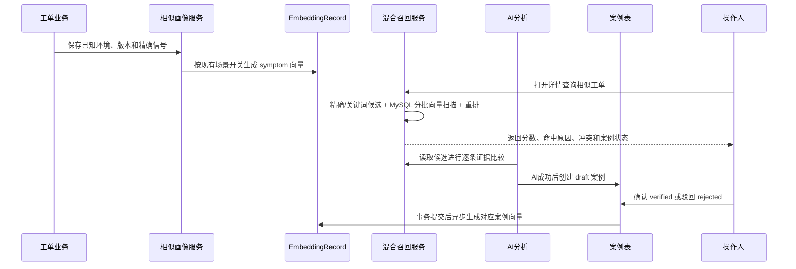

# 工单相似度案例索引流程

系统把表现相似和处理经验相似分开管理。表现相似向量使用标题、描述和稳定症状，处理经验案例使用证据、排查、根因、方案和验证结果。项目、模块、版本和环境作为结构化信号参与匹配，不直接承担自然语言语义。

## 数据职责

- `ticket`：工单业务主数据和 RCA 事实回写字段。
- `ticket_similarity_profile`：环境和画像版本等一对一检索画像。
- `ticket_similarity_signal`：错误码、Trace ID、Request ID 等可建立普通索引的精确信号。
- `ticket_similarity_case`：案例状态、案例文本摘要、确认信息和索引状态。
- `embedding_record`：按 `embedding_scope` 保存实际向量；旧记录默认为 `symptom`。

## 规则

- 缺少项目、模块、版本或环境不会阻塞入库，也不会因为候选字段为空而误判冲突。
- 明确相同的错误码、Trace ID、项目、模块或环境会增加匹配依据；明确不同的信号会标记冲突并降权。
- `status=closed`、AI分析成功、`processed_at` 或 `issue_confirmed` 不能单独把案例标记为 `verified`。
- 案例确认不等于 Issue 归因，相似度不会自动更新 `ticket.issue_id`。
- 普通评论不触发单条 Embedding；只有评论内容被纳入有效画像、RCA 或案例后才更新索引。
- 生产默认使用外部 Embedding 和 MySQL 分批扫描，Qdrant 不属于本流程的生产前置依赖。

## 前端确认入口（2026-09-05 补齐）

- 工单列表详情弹窗"概览"页的"处理案例相似"卡片顶部展示当前工单案例摘要，提供确认案例（信息不完整时禁用）、回退草稿、驳回案例（需填驳回原因）三个操作，权限 `ticket:similarity:case`，与后端接口一致。
- 概览接口 `GET /ticket/{ticket_id}/summary` 响应新增 `similarityCase` 摘要字段（`TicketSummaryModel`），未形成案例时 `caseStatus=none`。
- 独立只读详情页仅展示案例状态，不提供写操作；状态变更成功后前端同时刷新概览与相似结果（后端已失效相似缓存）。
