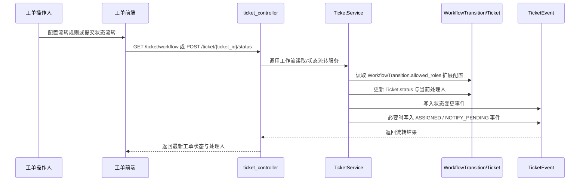

# 工单流转路由流程

该流程描述工单状态流转如何根据规则自动切换处理人，并为后续通知渠道保留统一入口。

## 入口信息

| 类型 | 方法 | 路径 | 触发条件 |
|---|---|---|---|
| http | GET | `/ticket/workflow` | 打开工单工作流配置页 |
| http | POST | `/ticket/{ticket_id}/status` | 在工单详情中执行状态流转 |

## 详细步骤

| 步骤 | 说明 |
|---|---|
| 1 | 工作流页和工单列表页读取状态节点和流转规则，并把 `allowed_roles` 扩展 JSON 展平成允许角色、默认处理人、通知预留。 |
| 2 | 用户在流转规则里配置默认处理人和通知备注后，前端提交给 `/ticket/workflow/transition`。 |
| 3 | `TicketService.save_workflow_transition` 将角色、处理人、通知配置统一写回 `WorkflowTransition.allowed_roles`。 |
| 4 | 工单状态流转弹窗按当前工单状态过滤 `WorkflowTransition`，只展示已配置规则的目标状态；新增状态节点后必须配置流转规则才会出现在下拉中。 |
| 5 | 工单状态流转时，`TicketService.change_ticket_status` 校验目标流转是否合法。 |
| 6 | 若命中默认处理人，服务端自动更新 `current_assignee_id/current_assignee_name`，并补写指派历史和 `ASSIGNED` 事件。 |
| 7 | 若规则开启通知预留，服务端追加 `NOTIFY_PENDING` 事件，后续通知渠道统一从该入口继续扩展。 |

## 错误处理

| 场景 | 处理方式 |
|---|---|
| 项目或模块无效 | 新增/编辑工单时直接返回失败，阻止保存错误归属。 |
| 流转规则不存在 | 状态流转接口直接拒绝，避免越过工作流状态机。 |
| 默认处理人已失效 | 流转仍可继续，但处理人名称会回退为空，需要重新配置规则。 |

## 参见

- [工单域](../entities/services/ticket-domain.md)
- [工单核心数据模型](../entities/data-models/ticket-core-models.md)
- [HRM 测试管理域](../entities/services/hrm-domain.md)

## 被引用

- [内容目录](../index.md)
- [工单域](../entities/services/ticket-domain.md)
- [工单核心数据模型](../entities/data-models/ticket-core-models.md)
- [工单枚举集](../entities/enums/ticket-enums.md)
