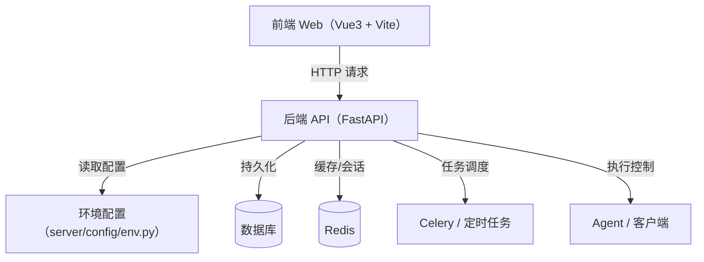

# 项目总览

QTestRunner 是一套基于 FastAPI + Vue3 + Vite 的测试管理平台。后端负责接口、调度、权限、任务与执行编排，前端负责管理控制台与业务操作界面。

## 技术栈

- 后端：Python 3.10、FastAPI、Uvicorn、Celery、SQLAlchemy、Redis、PyMySQL。
- 前端：Vue 3、Vite、Pinia、Vue Router、Element Plus。
- 运维：Docker、`docker-compose`、`uv`、`ruff`。

## 代码布局

- `server/`：后端主工程、路由、服务、权限、调度、工单与测试管理逻辑。
- `web/`：前端控制台，包含页面、组件、API 封装与构建配置。
- `client/`、`client_new/`：历史客户端实现。
- `docs/`：项目文档。

## 关键决策

- 后端以 `server/server.py` 创建 `FastAPI` 实例并集中注册路由，便于统一中间件、异常和生命周期管理。
- 配置通过 `server/config/env.py` 从 `--env` 参数和 `.env.*` 文件加载，支持开发、测试和生产环境切换。
- 前端通过 `web/src/main.js` 完成全局组件、指令、国际化、Element Plus 与路由/状态挂载。

## 参见

- [架构总览](concepts/architecture-overview.md)
- [模块全景图](concepts/module-landscape.md)
- [后端应用服务](entities/services/backend-application.md)
- [HTTP API 入口流程](flows/http-api-entrypoint.md)
- [项目目的](purpose.md)

## 被引用

- [Wiki 约定](schema.md)
- [前端启动骨架](entities/components/frontend-bootstrap.md)
