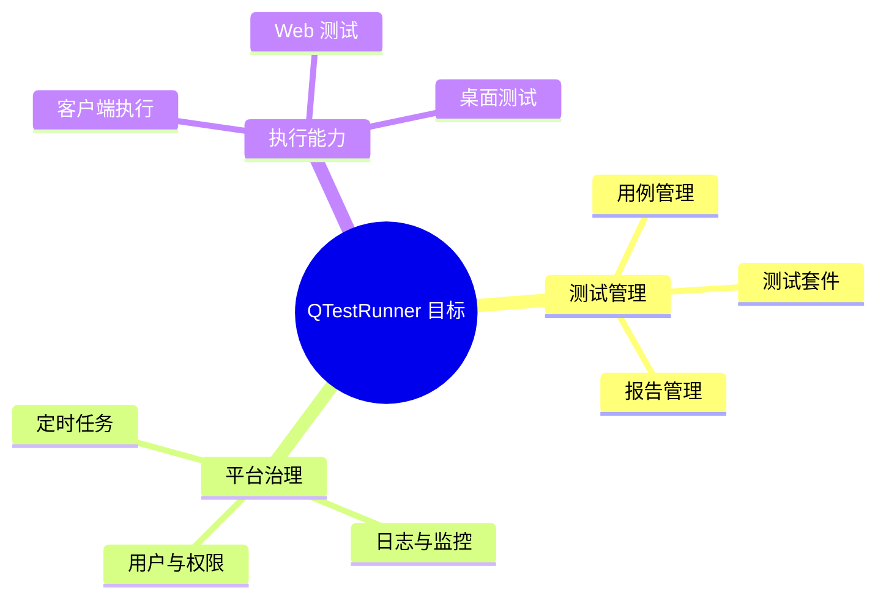

# 项目目的

项目定位为一套基于 FastAPI + Vue3 的接口测试与测试管理平台，覆盖接口管理、用例管理、测试套件、报告、定时任务、客户端转发与工单等能力。

## 参见

- [项目总览](overview.md)
- [架构总览](concepts/architecture-overview.md)
- [模块全景图](concepts/module-landscape.md)

## 被引用

- [后端应用服务](entities/services/backend-application.md)
- [HTTP API 入口流程](flows/http-api-entrypoint.md)
