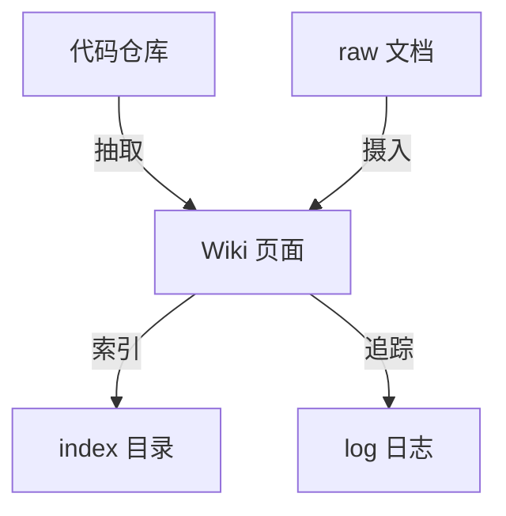

# Wiki 约定

本仓库的 Wiki 采用“代码为真实来源、文档为不可变输入”的统一知识库模式。

## 核心规则

- 页面文件名使用 `kebab-case`。
- 实体页、概念页、流程页必须包含至少一个 mermaid 图。
- 每个页面至少保留 2 个出站链接和 1 个入站链接。
- `raw/` 中的原始文档不直接修改，只做摄入与派生。

## 页面类型

- `overview`：项目总览。
- `purpose`：项目目标与研究方向。
- `concept`：跨模块概念。
- `entity`：服务、数据模型、枚举、组件。
- `flow`：入口链路与调用流程。
- `decision`：架构取舍。

## 参见

- [项目总览](overview.md)
- [后端应用服务](entities/services/backend-application.md)
- [前端启动骨架](entities/components/frontend-bootstrap.md)

## 被引用

- [后端应用服务](entities/services/backend-application.md)
- [前端启动骨架](entities/components/frontend-bootstrap.md)
